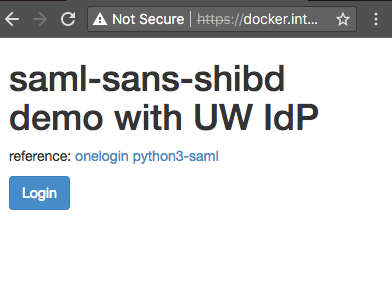
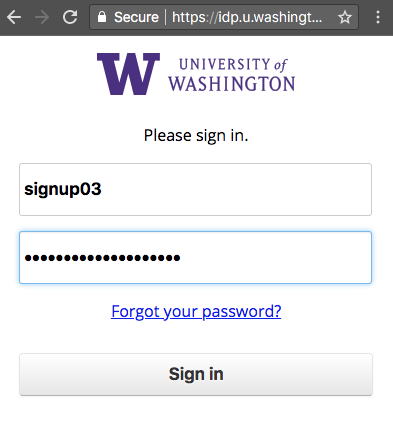
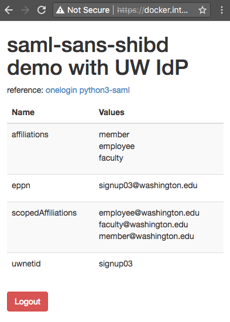

# SAML sans shibd

This project demonstrates a SAML login to UW's IdP without Shibboleth. This
allows us to be a SAML SP without the added baggage of running shibd and
apache mod_shib. This is a flask application running inside a docker container,
and the key dependency is OneLogin's 
[python3-saml package](https://github.com/onelogin/python3-saml).

## Run instructions

```
echo '127.0.0.1   docker.internal' >> /etc/hosts
openssl req -x509 -newkey rsa:4096 -nodes \
	-out cert.pem -keyout key.pem -days 365
docker run --name flaskapp --restart=always -p 443:443 -v `pwd`:/app \
       -d jazzdd/alpine-flask:python3 -d
```

The last `-d` runs flask in debug mode, without nginx/uwsgi. This allows us to
change our app on the fly, with the local changes being picked up and flask
being restarted. This also run https directly from flask. The task of getting
https working against nginx is an exercise left to the user.

The initial `docker run` takes a couple minutes to install and build packages.
You can tail the logs via `docker logs -f flaskapp` to see when it's ready.
`docker stop flaskapp` when you're done.


Now point your browser at `https://docker.internal`, authenticate, and 
see your attributes.

## Results

Initial page:



IdP page:



Page displaying attributes after a succesful authentication:


